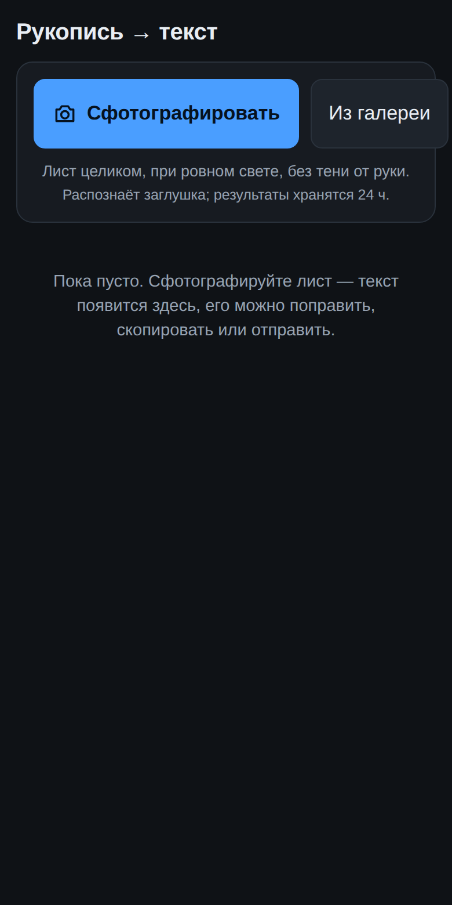
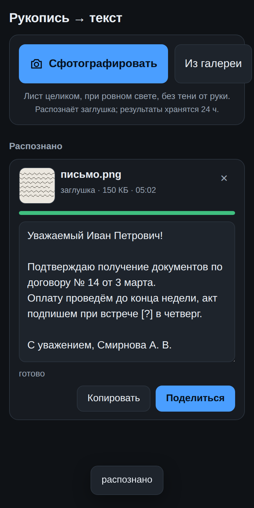

# handwriting-ocr — фото рукописи → печатный текст

Приложение для телефона: сфотографировал лист, исписанный от руки, — через
несколько секунд на экране тот же текст печатными буквами. Его можно
поправить, скопировать или отправить в любой мессенджер.

<p>
  
  
</p>

Ставится на домашний экран как обычное приложение (это PWA — работает и на
Android, и на iPhone, магазины не нужны). Камера открывается прямо из него; на
Android фото можно отправить и через «Поделиться».

Читать пропись умеют только облачные сервисы: оффлайн-распознавания
кириллической скорописи приемлемого качества сейчас нет. Поэтому фото уходит
на сервер, а тот — в один из двух движков на выбор:

| | Claude (Anthropic) | Yandex Vision OCR |
| --- | --- | --- |
| Качество на сложном почерке | выше: модель опирается на смысл фразы | ниже, но печатный и аккуратный текст читает уверенно |
| Где обрабатывается фото | серверы Anthropic, за рубежом | дата-центры в России |
| Что нужно завести | ключ на console.anthropic.com, оплата картой | аккаунт Yandex Cloud, оплата в рублях |
| Ориентировочная цена | 1–2 ¢ за фото (`claude-opus-5`) | по прайсу Yandex Vision, порядка копеек за фото |

## Запуск

```bash
cp .env.example .env      # вписать ключ движка
docker compose up -d --build
```

Дальше открыть на телефоне `http://адрес-сервера:8080` и добавить страницу на
домашний экран: в Chrome это «Установить приложение», в Safari — «На экран
„Домой“».

Без Docker:

```bash
pip install -e ".[claude]"          # или просто `pip install -e .` для Яндекса
export ANTHROPIC_API_KEY=sk-ant-...
python -m hwocr serve
```

Нужен Python 3.11+. Сервер без ключа не поднимается: он пишет, какой
переменной не хватает, и выходит.

## На сервере, с телефона из любого места

Дома по `http://` всё работает, а из интернета телефону нужен HTTPS: без него
браузер не даст ни поставить приложение на домашний экран, ни нажать
«Копировать», ни принять фото через «Поделиться». И нужен пароль: каждое фото
стоит денег, случайно найденный адрес не должен тратить ваш ключ.

Обе вещи делает Caddy из `docker-compose.https.yml`. Домен — свой или
бесплатный по IP вида `1.2.3.4.sslip.io` (Let's Encrypt такие выдаёт).

```bash
nano .env                                 # + HWOCR_DOMAIN=… и HWOCR_EMAIL=…
bash ../deploy/hwocr-auth.sh имя пароль   # логин для входа с телефона
docker compose -f docker-compose.yml -f docker-compose.https.yml up -d --build
```

Порты 80 и 443 должны быть открыты в фаерволе. Если сервер подготовлен
`server-setup.sh` из корня репозитория, это делает `deploy/install.sh` — он же
ставит автообновление: после каждого изменения в `main` с зелёным CI сервер
пересоберёт приложение сам и отчитается в Telegram. Подробнее —
[`DEPLOY.md`](../DEPLOY.md#автообновление-из-main).

## Как пользоваться

1. «Сфотографировать» — лист целиком, при ровном свете, без тени от руки.
   Или «Из галереи», можно сразу несколько.
2. Снимок сжимается на телефоне и уходит на сервер; через 5–30 секунд в
   карточке появляется текст.
3. Текст можно править прямо в карточке — правки сохраняются сами.
   Неразборчивые места движок помечает `[?]`.
4. «Копировать» кладёт текст в буфер, «Поделиться» открывает системное меню
   (Telegram, WhatsApp, заметки…).

Фото и текст хранятся на сервере сутки (флаг `--keep-hours`), потом
удаляются. Нужное — копируйте себе.

## Из командной строки

```bash
python -m hwocr recognize лист.jpg                  # печатает текст
python -m hwocr recognize лист.jpg --engine yandex  # другим движком
```

Так проще всего проверить ключ и посмотреть, что движок выдаёт на конкретном
фото, — без сервера и телефона.

## Настройки

Ключи — в `.env` (см. `.env.example` с пояснениями):

| Переменная | Зачем |
| --- | --- |
| `OCR_ENGINE` | `claude` (по умолчанию) или `yandex` |
| `ANTHROPIC_API_KEY` | ключ Anthropic |
| `CLAUDE_MODEL` | модель, по умолчанию `claude-opus-5` |
| `CLAUDE_FALLBACKS` | `0` — отключить серверный запасной маршрут, если API ругается на «beta» |
| `YC_API_KEY`, `YC_FOLDER_ID` | ключ сервисного аккаунта и каталог Yandex Cloud |

Остальное — флаги `serve` (в `docker-compose.yml` они уже вписаны):

| Флаг | По умолчанию | Зачем |
| --- | --- | --- |
| `--port` | `8080` | порт |
| `--data` | `data` | каталог с базой и фотографиями |
| `--max-upload` | `15` | предел размера фото, МБ |
| `--keep-hours` | `24` | через сколько часов удалять результаты |
| `--keep-count` | `200` | сколько последних результатов держать всегда |

Если сервер стоит за reverse-proxy (nginx, Caddy), для `/api/jobs/*/events`
нужно выключить буферизацию ответа (`proxy_buffering off` в nginx): это поток
событий, и с буфером прогресс на телефоне появится только в самом конце.

## API

Приложение — обычный клиент этого API, распознавание можно встроить куда
угодно.

```
GET    /api/config              движок, лимиты
GET    /api/jobs                список задач
POST   /api/jobs?name=          тело — фото (JPEG, PNG, WebP), ответ — задача
GET    /api/jobs/{id}           состояние и текст
GET    /api/jobs/{id}/events    изменения потоком (Server-Sent Events)
GET    /api/jobs/{id}/image     исходное фото
PUT    /api/jobs/{id}/text      {"text": "..."} — сохранить правки
DELETE /api/jobs/{id}           отменить и удалить
POST   /share                   приём из «Поделиться» (multipart)
```

```bash
curl -X POST --data-binary @лист.jpg -H 'Content-Type: image/jpeg' \
     'http://localhost:8080/api/jobs?name=лист.jpg'
```

## Как устроено

* **Сервер** — Python без внешних зависимостей: `http.server`, очередь задач
  в SQLite, один фоновый работник (упирается всё в лимиты облачного API, а не
  в процессор), прогресс через SSE. Каркас перенесён из
  [`pdf-translator`](../pdf-translator/) как есть.
* **Движки** — за общим интерфейсом `Recognizer.recognize(байты, тип) → текст`
  (`hwocr/recognize/`). Claude — через официальный клиент `anthropic`
  (единственная необязательная зависимость); Яндекс — один POST на `urllib`.
  Любая ошибка движка превращается в русское сообщение в карточке: «ключ не
  подошёл», «слишком часто», «нет связи».
* **Телефон** — ванильный JS. Снимок сжимается на канвасе до 2000 px по
  длинной стороне (в 5–10 раз меньше трафика, а HEIC с iPhone по дороге
  становится JPEG). Правки текста уходят на сервер через 0,8 с после
  последней буквы.

## Что проверено вживую

* Вся цепочка с настоящим клиентом `anthropic` и неверным ключом: сервер
  принимает фото, обращается к `api.anthropic.com`, получает 401 и показывает
  «ключ Anthropic не подошёл». Значит сеть, клиент и обработка ошибок работают.
* Интерфейс в Chromium с телефонным размером экрана: загрузка, карточка с
  текстом, правка и её сохранение (скриншоты выше сняты именно так).
* 77 тестов без сети: оба адаптера на заглушках, очередь, хранилище, HTTP.

## Что не проверено

* **Распознавание настоящего почерка** через Claude — в среде разработки не
  было ключа. Проверить: `python -m hwocr recognize фото.jpg` с ключом в
  окружении.
* **Yandex Vision OCR** — адрес сервиса закрыт прокси среды разработки.
  Формат запроса и ответа взят из документации; первую проверку делайте
  той же командой с `--engine yandex`.
* **Реальный телефон**: камера, «Поделиться», установка на домашний экран.
  Известные ограничения: Safari на iPhone не поддерживает «Поделиться» в
  PWA — там только кнопки внутри приложения; через «Поделиться» принимается
  одно фото за раз.
* **Сборка Docker-образа** — в песочнице нет доступа к Docker Hub; образ
  собирается в CI (`.github/workflows/handwriting-ocr-ci.yml`).
* **HTTPS с Caddy и паролем** на живом сервере. Compose-файлы складываются
  и Caddyfile проходит `caddy validate` в CI; выдача сертификата и вход с
  телефона по паролю (особенно из установленного на домашний экран
  приложения на iPhone) ждут проверки вживую.

## Персональные данные

На фотографиях с рукописным текстом бывают имена, адреса, подписи. Для себя
это не проблема: сервер ваш, фото удаляются через сутки. Если предлагать
распознавание другим людям как услугу, вступает 152-ФЗ: с движком Claude фото
уходит за границу (нужны согласие на трансграничную передачу и уведомление
Роскомнадзора), с Яндексом остаётся в России (нужны согласие и политика
обработки). Заголовок `x-data-logging-enabled: false` просит Яндекс не хранить
присланные фото.

## Лицензии

Клиент `anthropic` — MIT. Всё остальное — стандартная библиотека Python и
собственный код.

## Разработка

```bash
pip install -e ".[dev]"
pytest -q          # 77 тестов, сеть не нужна
ruff check .
```

Тесты без установленного `anthropic` обязаны проходить: клиент импортируется
лениво, а в тестах подменён заглушкой с тем же интерфейсом.
