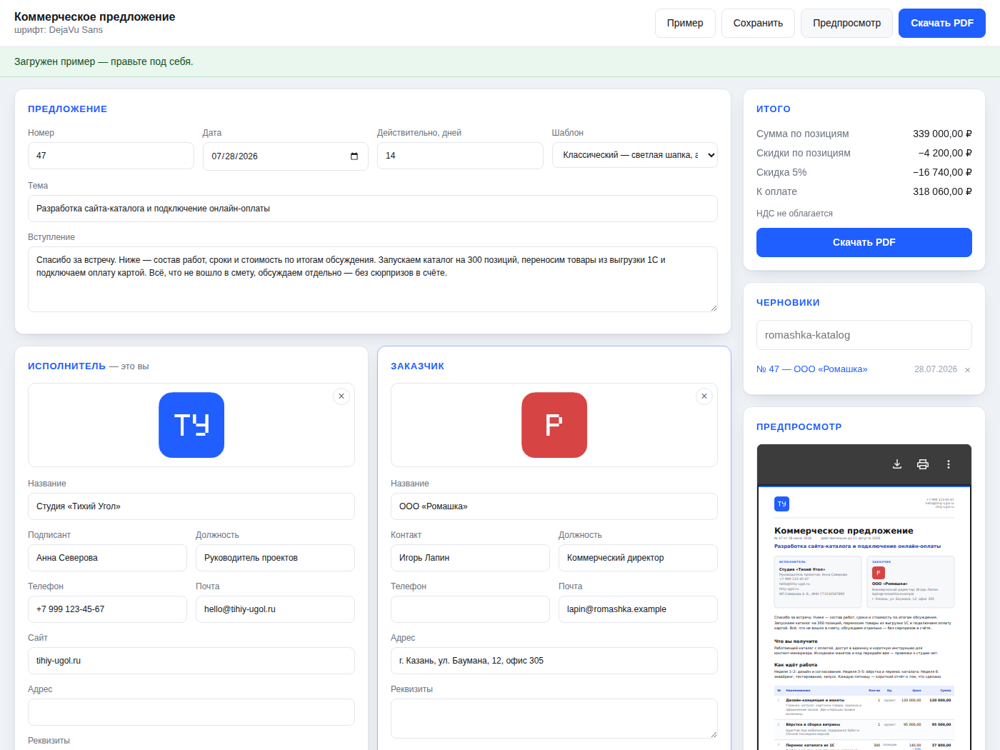
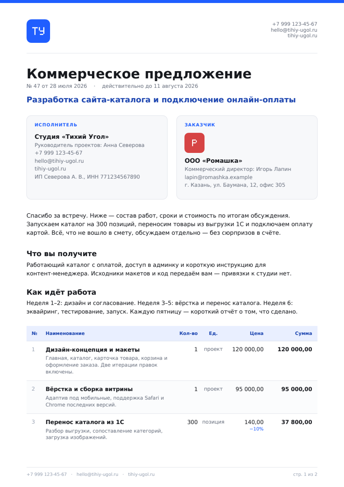
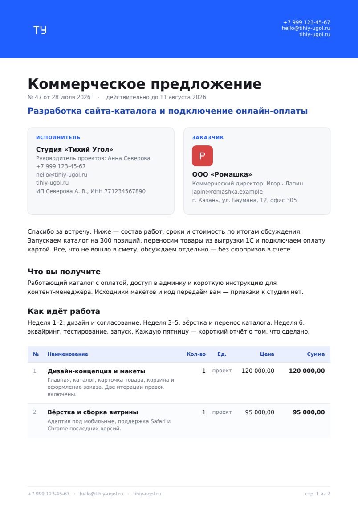

# Генератор коммерческих предложений

Заполняете форму — получаете аккуратное КП в PDF: с вашим логотипом, логотипом
заказчика, сметой, итогами, суммой прописью и подписью. Черновики сохраняются,
чтобы следующее предложение делать копией предыдущего.

**Зависимостей нет** — только стандартная библиотека Python 3.11+ и чистый
HTML/CSS/JS. PDF собирается своим кодом: встраивание шрифта с кириллицей,
подмножество глифов, PNG и JPEG с прозрачностью — всё внутри пакета
[`proposals/pdf`](proposals/pdf/).



## Быстрый старт

```bash
cd proposal-generator

# 1. Посмотреть, что получается, — пример без всякой настройки
python3 -m proposals demo --out kp.pdf

# 2. Открыть форму
python3 -m proposals serve
# → http://127.0.0.1:8000
```

Форма локальная: слушает только `127.0.0.1`, данные никуда не уходят,
черновики лежат файлами в `~/.proposals`.

## Что получается

| Классический | Современный |
|---|---|
|  |  |

В документе: шапка с логотипами, карточки сторон, вступление, произвольные
текстовые блоки, смета с описаниями и построчными скидками, итоги с НДС,
сумма прописью, условия и блок подписи. Таблица переносится на следующую
страницу с повтором шапки, в колонтитуле — «стр. 2 из 3».

## Командная строка

```bash
# PDF из черновика
python3 -m proposals render samples/demo.proposal.json --out kp.pdf

# Подменить логотип заказчика и акцентный цвет, не трогая файл
python3 -m proposals render kp.proposal.json \
    --logo-client ~/logos/romashka.png --accent "#0f766e" --template modern

# Собрать из JSON на stdin и отдать PDF в stdout
cat kp.proposal.json | python3 -m proposals render - --out - > kp.pdf

# Что где лежит
python3 -m proposals drafts
python3 -m proposals font
```

## Формат черновика

Обычный JSON — его можно писать руками, хранить в git и генерировать из своей
CRM. Полный пример: [`samples/demo.proposal.json`](samples/demo.proposal.json).

```json
{
  "number": "47",
  "issued_at": "2026-07-28",
  "valid_days": 14,
  "subject": "Разработка сайта-каталога",
  "intro": "Спасибо за встречу…",
  "sender": {"name": "Студия «Тихий Угол»", "email": "hello@studio.ru"},
  "client": {"name": "ООО «Ромашка»", "logo": "data:image/png;base64,iVBOR…"},
  "items": [
    {"title": "Дизайн-концепция", "description": "Пять экранов",
     "quantity": 1, "unit": "проект", "price": "120000", "discount_percent": "0"},
    {"title": "Перенос каталога", "quantity": 300, "unit": "позиция",
     "price": "140", "discount_percent": "10"}
  ],
  "sections": [{"title": "Что вы получите", "body": "…"}],
  "currency": "RUB",
  "vat_mode": "none",
  "discount_percent": "5",
  "accent": "#1f5eff",
  "template": "classic"
}
```

Логотип принимается и как `data:`-URL из формы, и как голый base64. Кривой JSON
не роняет генератор: непонятные числа становятся нулями, пустые позиции
выбрасываются, неизвестный режим НДС превращается в «не облагается».

### НДС и скидки

Порядок расчёта такой же, как в привычном счёте: сначала строки со своими
скидками, потом общая скидка на остаток, и только затем НДС.

| `vat_mode` | Что происходит |
|---|---|
| `none` | «НДС не облагается» — УСН, самозанятые, патент |
| `included` | НДС выделяется из суммы, к оплате она не меняется |
| `added` | НДС начисляется сверху |

Всё считается в `Decimal` с округлением ROUND_HALF_UP, поэтому «итого» всегда
равно сумме строк. Те же формулы продублированы в JS формы (в копейках целыми
числами) — цифра на экране и цифра в файле совпадают до копейки.

## Про шрифты — честно

В PDF есть 14 встроенных шрифтов, и кириллицы нет ни в одном. Значит, шрифт
надо встраивать, а взять его можно только из системы. Генератор ищет знакомые
семейства с кириллицей — DejaVu Sans, Liberation Sans, Noto Sans, FreeSans,
Arial — в обычных каталогах Linux, macOS и Windows.

```bash
python3 -m proposals font                       # что нашлось
python3 -m proposals demo --font "Liberation Sans"
python3 -m proposals demo --font ~/fonts/MyBrand.ttf
```

Если не нашлось ничего: `apt install fonts-dejavu-core` (Debian/Ubuntu) или
`dnf install dejavu-sans-fonts` (Fedora). Нужен именно **TrueType** (`.ttf`):
`.otf` с контурами CFF устроен иначе и не поддерживается.

Целиком DejaVu Sans весит 750 КБ, поэтому в файл уезжают только встретившиеся
в тексте глифы — обычное предложение выходит на 50 КБ вместе с логотипами.
Текст из готового PDF нормально копируется и ищется: рядом со шрифтом лежит
карта ToUnicode.

## Логотипы

PNG (в том числе с прозрачностью, палитрой и чересстрочный) и JPEG. SVG не
поддерживается — сохраните его в PNG. Прозрачность уезжает в `/SMask`, поэтому
логотип с прозрачным фоном ложится на цветную плашку без белого прямоугольника.
Картинки крупнее 1000 px по большей стороне уменьшаются: логотип в КП занимает
от силы 200 пунктов, всё остальное только раздувает файл.

Если логотип не читается, PDF всё равно соберётся — генератор вернёт
предупреждение (в CLI на stderr, в форме — плашкой сверху).

## Как это устроено

```
proposals/
  pdf/            свой мини-движок PDF, ничего не знает про КП
    objects.py    объекты, потоки, таблица xref
    fonts.py      разбор TrueType, подмножество глифов, CIDFontType2
    images.py     PNG (все типы цвета и Adam7) и JPEG → XObject
    document.py   холст: текст с переносами, фигуры, картинки, страницы
  models.py       модель предложения и вся арифметика
  money.py        округление, форматирование, сумма прописью
  template.py     вёрстка КП: два шаблона, разрывы страниц, колонтитулы
  storage.py      черновики в JSON
  server.py       локальный http.server под форму
  cli.py          команды serve / render / demo / drafts / font
web/              форма: index.html + style.css + app.js
```

Координаты в `document.py` человеческие — начало в левом верхнем углу, `y`
растёт вниз; переворот в систему PDF происходит один раз при записи.

## Как использовать как библиотеку

```python
from pathlib import Path
from proposals import LineItem, Party, Proposal, render

proposal = Proposal(
    number="12",
    subject="Съёмка каталога",
    sender=Party(name="Фотостудия «Свет»", email="hi@svet.ru"),
    client=Party(name="ООО «Ромашка»", logo=Path("logo.png").read_bytes()),
    items=[LineItem(title="Съёмка", quantity=40, unit="кадр", price=900)],
    payment_terms="100% предоплата",
)
data, warnings = render(proposal)
Path("kp.pdf").write_bytes(data)
```

Движок PDF можно взять и отдельно от предложений:

```python
from proposals.pdf import Document, find_family

doc = Document(find_family(), title="Отчёт")
page = doc.new_page()
page.text(46, 60, "Привет", size=22, style="bold")
page.paragraph(46, 100, 500, "Длинный текст сам переносится по ширине.")
Path("out.pdf").write_bytes(doc.render())
```

## Разработка

```bash
pip install -e ".[dev]"
pytest -q
ruff check .
```

Тесты не ходят в сеть и не требуют ничего, кроме шрифта с кириллицей: если его
в системе нет, относящиеся к PDF тесты пропускаются. Проверяется и то, что
обычно ломается молча, — что ничего не уезжает за поля страницы, что скидки не
разъезжаются с итогом на копейку и что повторный рендер даёт те же байты.
