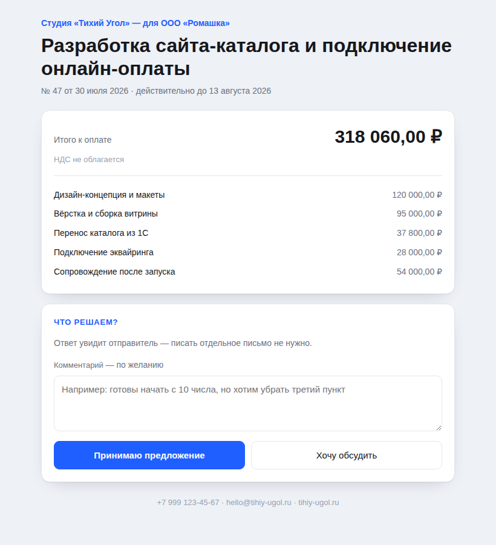
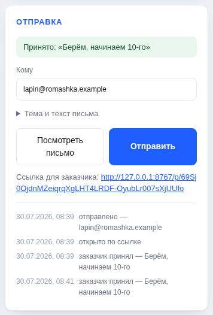
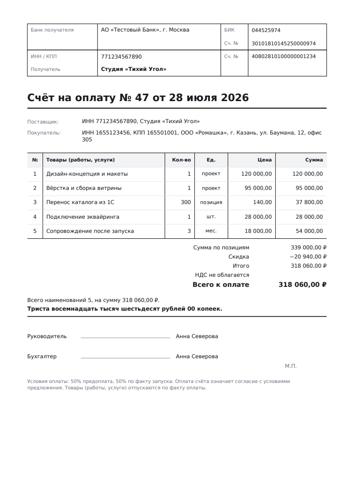

# Генератор коммерческих предложений

Заполняете форму — получаете аккуратное КП в PDF: с вашим логотипом, логотипом
заказчика, сметой, итогами, суммой прописью и подписью. Дальше предложение
уходит заказчику письмом, а вы видите, что с ним стало: открыл, принял или
хочет обсудить. Молчит неделю — одна кнопка, чтобы напомнить. Согласился — из
того же черновика выходит счёт на оплату. Черновики сохраняются, чтобы
следующее КП делать копией предыдущего.

**Зависимостей нет** — только стандартная библиотека Python 3.11+ и чистый
HTML/CSS/JS. PDF собирается своим кодом: встраивание шрифта с кириллицей,
подмножество глифов, PNG и JPEG с прозрачностью — всё внутри пакета
[`proposals/pdf`](proposals/pdf/).


## Быстрый старт

```bash
cd proposal-generator

# 1. Посмотреть, что получается, — пример без всякой настройки
python3 -m proposals demo --out kp.pdf

# 2. Открыть форму
python3 -m proposals serve
# → http://127.0.0.1:8000
```

Форма локальная: слушает только `127.0.0.1`, черновики лежат файлами в
`~/.proposals`. Наружу что-то уходит ровно в одном случае — когда вы сами
нажимаете «Отправить»; тогда письмо идёт через ваш почтовый ящик, см.
[«Отправка и статусы»](#отправка-и-статусы).

## Что получается

| Классический | Современный |
|---|---|
|  |  |

В документе: шапка с логотипами, карточки сторон, вступление, произвольные
текстовые блоки, смета с описаниями и построчными скидками, итоги с НДС,
сумма прописью, условия и блок подписи. Таблица переносится на следующую
страницу с повтором шапки, в колонтитуле — «стр. 2 из 3».

## Отправка и статусы

Предложение можно не выгружать вручную, а отправить прямо из формы. В письме
уходит PDF во вложении и ссылка на страницу предложения; на этой странице
заказчик видит смету, сам документ и две кнопки — «принимаю» и «хочу
обсудить».



Ответ сразу виден в форме: статус, время и комментарий заказчика.



Статусы идут по цепочке `черновик → отправлено → просмотрено →
принято / отклонено`, а в списке черновиков считается воронка: сколько ушло,
сколько принято и на какую сумму.

```bash
# 1. Один раз настроить почту (пароль спросим со стандартного ввода)
python3 -m proposals smtp --host smtp.yandex.ru --user me@yandex.ru \
    --sender-name "Студия «Тихий Угол»" --password - --ssl ssl --check

# 2. Запустить форму так, чтобы ссылки в письмах были рабочими
python3 -m proposals serve --public-url https://kp.tihiy-ugol.ru

# 3. Или отправить из командной строки
python3 -m proposals send romashka --to lapin@romashka.ru \
    --public-url https://kp.tihiy-ugol.ru --dry-run   # посмотреть письмо
python3 -m proposals send romashka --public-url https://kp.tihiy-ugol.ru

# 4. Посмотреть, что происходит
python3 -m proposals status            # воронка по всем
python3 -m proposals status romashka   # журнал одного предложения
```

### Напоминания

Предложения чаще всего умирают не от «нет», а от тишины. `status` показывает,
кто сколько молчит, а `remind` пишет вежливое письмо тем, кто молчит дольше
срока:

```bash
python3 -m proposals status                     # …ООО «Ромашка» молчит 8 дн.
python3 -m proposals remind --after 5 --dry-run  # посмотреть, кому и что уйдёт
python3 -m proposals remind --after 5 --public-url https://kp.tihiy-ugol.ru
```

В форме на панели отправки появляется кнопка «Напомнить — молчит 8 дн.».

Счётчик молчания после напоминания начинается заново — иначе одно и то же
предложение считалось бы просроченным вечно и письма шли бы каждый день.
Принятое или отклонённое предложение из напоминаний выпадает.

Команду удобно повесить в `cron`, но помните: напоминание легко превращается в
навязчивость. Текст письма поэтому короткий и прямо предлагает ответить
«неактуально».

## Счёт на оплату

Предложение приняли — счёт собирается из тех же данных: стороны, позиции,
суммы уже есть.



```bash
python3 -m proposals invoice romashka --out schet.pdf
python3 -m proposals invoice romashka --number "СЧ-100" --date 01.08.2026
```

В форме — кнопка «Счёт на оплату» рядом со «Скачать PDF».

Вёрстка нарочно консервативная: рамка с банковскими реквизитами, «Счёт на
оплату № N от даты», поставщик и покупатель, таблица, сумма прописью, подписи
и место под печать. Так счёт выглядит в 1С — бухгалтер находит нужное поле не
читая, и лишний повод для вопросов не возникает.

Чтобы счёт оплатили, нужны реквизиты исполнителя — они заполняются в форме
(«Реквизиты для счёта» в карточке исполнителя) и живут в черновике:

```json
"sender": {
  "name": "Студия «Тихий Угол»",
  "inn": "771234567890",
  "bank": {
    "name": "АО «Тестовый Банк», г. Москва",
    "bik": "044525974",
    "account": "40802810100000001234",
    "corr_account": "30101810145250000974"
  }
}
```

Пробелы из номеров вычищаются сами — их обычно копируют из платёжки. Если
реквизитов нет, счёт всё равно соберётся, но с предупреждением: бывает, что
их вписывают руками.

### Что нужно, чтобы ссылка работала

Заказчик открывает ссылку снаружи, поэтому сервер должен быть доступен из
интернета, а `--public-url` — совпадать с адресом, по которому его видно.
Проще всего пробросить туннелем (`cloudflared tunnel --url
http://127.0.0.1:8000`) или поставить за реверс-прокси.

Форма при этом наружу не открывается: приватные маршруты отвечают только
запросам с самой машины. Если всё же запустить сервер на внешнем адресе
(`--host 0.0.0.0`), генератор придумает ключ доступа и напечатает ссылку с
ним — без ключа форма не откроется. Публичными остаются только страницы
`/p/<токен>`.

### Про «просмотрено» — честно

Отметка ставится, когда открыли **ссылку**, а не вложение. Пиксель-трекер в
письме мы намеренно не используем: почтовые клиенты режут картинки, так что
цифра всё равно врёт, а следить за человеком без его ведома — плохой обмен.
Значит, если заказчик открыл только PDF из вложения, предложение так и
останется в статусе «отправлено». Это честнее, чем ложное «просмотрено».
Ссылку знает лишь тот, кому вы её отправили: в адресе 32 случайных байта,
подобрать их нельзя, а на странице нет ни ваших других предложений, ни формы.

### Пароль от почты

Он не хранится в черновиках — они уезжают коллегам и в git. Пароль лежит
только в `~/.proposals/smtp.json` с правами `600` либо в переменных окружения
(`PROPOSALS_SMTP_HOST`, `PROPOSALS_SMTP_USER`, `PROPOSALS_SMTP_PASSWORD`,
`PROPOSALS_SMTP_SENDER`, `PROPOSALS_SMTP_SSL`) — окружение сильнее файла, так
что на диск пароль можно не класть вовсе. Для Яндекса, Mail.ru и Gmail нужен
отдельный **пароль приложения**, а не пароль от аккаунта.

## Командная строка

```bash
# PDF из черновика
python3 -m proposals render samples/demo.proposal.json --out kp.pdf

# Подменить логотип заказчика и акцентный цвет, не трогая файл
python3 -m proposals render kp.proposal.json \
    --logo-client ~/logos/romashka.png --accent "#0f766e" --template modern

# Собрать из JSON на stdin и отдать PDF в stdout
cat kp.proposal.json | python3 -m proposals render - --out - > kp.pdf

# Счёт по тем же данным
python3 -m proposals invoice samples/demo.proposal.json --out schet.pdf

# Что где лежит
python3 -m proposals drafts
python3 -m proposals font
```

## Формат черновика

Обычный JSON — его можно писать руками, хранить в git и генерировать из своей
CRM. Полный пример: [`samples/demo.proposal.json`](samples/demo.proposal.json).

```json
{
  "number": "47",
  "issued_at": "2026-07-28",
  "valid_days": 14,
  "subject": "Разработка сайта-каталога",
  "intro": "Спасибо за встречу…",
  "sender": {"name": "Студия «Тихий Угол»", "email": "hello@studio.ru"},
  "client": {"name": "ООО «Ромашка»", "logo": "data:image/png;base64,iVBOR…"},
  "items": [
    {"title": "Дизайн-концепция", "description": "Пять экранов",
     "quantity": 1, "unit": "проект", "price": "120000", "discount_percent": "0"},
    {"title": "Перенос каталога", "quantity": 300, "unit": "позиция",
     "price": "140", "discount_percent": "10"}
  ],
  "sections": [{"title": "Что вы получите", "body": "…"}],
  "currency": "RUB",
  "vat_mode": "none",
  "discount_percent": "5",
  "accent": "#1f5eff",
  "template": "classic"
}
```

Рядом с документом в том же файле лежит секция `delivery` — статус, журнал
событий и токен ссылки. Её пишет сервер, а не форма: иначе достаточно было бы
сохранить черновик, чтобы заодно переписать статус или подсунуть чужой токен.

Логотип принимается и как `data:`-URL из формы, и как голый base64. Кривой JSON
не роняет генератор: непонятные числа становятся нулями, пустые позиции
выбрасываются, неизвестный режим НДС превращается в «не облагается».

### НДС и скидки

Порядок расчёта такой же, как в привычном счёте: сначала строки со своими
скидками, потом общая скидка на остаток, и только затем НДС.

| `vat_mode` | Что происходит |
|---|---|
| `none` | «НДС не облагается» — УСН, самозанятые, патент |
| `included` | НДС выделяется из суммы, к оплате она не меняется |
| `added` | НДС начисляется сверху |

Всё считается в `Decimal` с округлением ROUND_HALF_UP, поэтому «итого» всегда
равно сумме строк. Те же формулы продублированы в JS формы (в копейках целыми
числами) — цифра на экране и цифра в файле совпадают до копейки.

## Про шрифты — честно

В PDF есть 14 встроенных шрифтов, и кириллицы нет ни в одном. Значит, шрифт
надо встраивать, а взять его можно только из системы. Генератор ищет знакомые
семейства с кириллицей — DejaVu Sans, Liberation Sans, Noto Sans, FreeSans,
Arial — в обычных каталогах Linux, macOS и Windows.

```bash
python3 -m proposals font                       # что нашлось
python3 -m proposals demo --font "Liberation Sans"
python3 -m proposals demo --font ~/fonts/MyBrand.ttf
```

Если не нашлось ничего: `apt install fonts-dejavu-core` (Debian/Ubuntu) или
`dnf install dejavu-sans-fonts` (Fedora). Нужен именно **TrueType** (`.ttf`):
`.otf` с контурами CFF устроен иначе и не поддерживается.

Целиком DejaVu Sans весит 750 КБ, поэтому в файл уезжают только встретившиеся
в тексте глифы — обычное предложение выходит на 50 КБ вместе с логотипами.
Текст из готового PDF нормально копируется и ищется: рядом со шрифтом лежит
карта ToUnicode.

## Логотипы

PNG (в том числе с прозрачностью, палитрой и чересстрочный) и JPEG. SVG не
поддерживается — сохраните его в PNG. Прозрачность уезжает в `/SMask`, поэтому
логотип с прозрачным фоном ложится на цветную плашку без белого прямоугольника.
Картинки крупнее 1000 px по большей стороне уменьшаются: логотип в КП занимает
от силы 200 пунктов, всё остальное только раздувает файл.

Если логотип не читается, PDF всё равно соберётся — генератор вернёт
предупреждение (в CLI на stderr, в форме — плашкой сверху).

## Как это устроено

```
proposals/
  pdf/            свой мини-движок PDF, ничего не знает про КП
    objects.py    объекты, потоки, таблица xref
    fonts.py      разбор TrueType, подмножество глифов, CIDFontType2
    images.py     PNG (все типы цвета и Adam7) и JPEG → XObject
    document.py   холст: текст с переносами, фигуры, картинки, страницы
  models.py       модель предложения и вся арифметика
  money.py        округление, форматирование, сумма прописью
  template.py     вёрстка КП: два шаблона, разрывы страниц, колонтитулы
  delivery.py     статусы, журнал, срок молчания и воронка
  mailer.py       письмо с PDF, напоминание и настройки SMTP
  invoice.py      счёт на оплату из тех же данных
  storage.py      черновики в JSON, поиск по токену ссылки
  server.py       http.server: приватная форма и публичная страница заказчика
  cli.py          команды serve / render / send / remind / invoice / status / smtp / …
  web/            форма (index+app) и страница заказчика (view)
```

Статика лежит внутри пакета, а не рядом с ним, — тогда она едет и в колесо, и
в editable-установку, и команда `proposals serve` работает из любого каталога.

Координаты в `document.py` человеческие — начало в левом верхнем углу, `y`
растёт вниз; переворот в систему PDF происходит один раз при записи.

## Как использовать как библиотеку

```python
from pathlib import Path
from proposals import LineItem, Party, Proposal, render

proposal = Proposal(
    number="12",
    subject="Съёмка каталога",
    sender=Party(name="Фотостудия «Свет»", email="hi@svet.ru"),
    client=Party(name="ООО «Ромашка»", logo=Path("logo.png").read_bytes()),
    items=[LineItem(title="Съёмка", quantity=40, unit="кадр", price=900)],
    payment_terms="100% предоплата",
)
data, warnings = render(proposal)
Path("kp.pdf").write_bytes(data)
```

Счёт собирается из того же объекта:

```python
from proposals import invoice

data, warnings = invoice.render(proposal, number="СЧ-100")
Path("schet.pdf").write_bytes(data)
```

Движок PDF можно взять и отдельно от предложений:

```python
from proposals.pdf import Document, find_family

doc = Document(find_family(), title="Отчёт")
page = doc.new_page()
page.text(46, 60, "Привет", size=22, style="bold")
page.paragraph(46, 100, 500, "Длинный текст сам переносится по ширине.")
Path("out.pdf").write_bytes(doc.render())
```

## Разработка

```bash
pip install -e ".[dev]"
pytest -q
ruff check .
```

Тесты не ходят в сеть и не требуют ничего, кроме шрифта с кириллицей: если его
в системе нет, относящиеся к PDF тесты пропускаются. Письма собираются
по-настоящему, но отправка подменяется — наружу ничего не уходит.

Проверяется и то, что обычно ломается молча: что ничего не уезжает за поля
страницы, что скидки не разъезжаются с итогом на копейку, что повторный рендер
даёт те же байты, что повторный просмотр не сбрасывает уже принятое
предложение, что напоминание не уходит по уже решённому предложению и что
публичная страница не отдаёт ни токен, ни адрес получателя, ни чужие
предложения.
