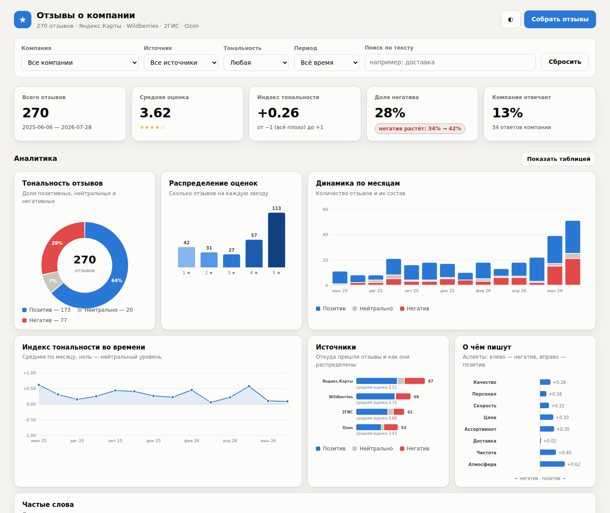

# Парсер отзывов с дашбордом

Собирает отзывы о компании с внешних площадок (Яндекс.Карты, 2ГИС, Wildberries,
Ozon, локальные выгрузки), определяет тональность каждого отзыва и показывает
сводку на веб-странице: доли позитива и негатива, динамику по месяцам, разрез по
площадкам, аспекты («о чём пишут») и ленту самих отзывов с фильтрами.

**Зависимостей нет** — только стандартная библиотека Python 3.10+ и чистый
HTML/CSS/JS. Ставить ничего не нужно, собирать фронтенд тоже.



## Быстрый старт

```bash
cd reviews-dashboard

# 1. Набить базу демо-данными (сеть не нужна)
python3 -m reviews collect --source demo --query "Кофейня Тёплый угол" --limit 180

# 2. Запустить дашборд
python3 -m reviews serve
# → http://127.0.0.1:8000
```

Дальше отзывы можно докладывать прямо из интерфейса — кнопка «Собрать отзывы».

## Источники

| Источник | Что передавать в `--query` | Как работает |
|---|---|---|
| `yandex` | ссылка на организацию или её id | разбирает микроразметку schema.org и JSON-LD со страницы отзывов |
| `2gis` | ссылка на филиал или его id | публичный API виджета отзывов, нужен ключ `GIS2_API_KEY` |
| `wildberries` | артикул товара или ссылка на карточку | карточка → `imtId` → открытый сервис отзывов, ключи не нужны |
| `ozon` | ссылка на товар | `composer-api` страницы отзывов |
| `file` | путь к JSON или CSV | импорт готовой выгрузки, колонки распознаются по синонимам |
| `demo` | любое название | генерирует правдоподобный набор отзывов офлайн |

### Про антибот-защиту — честно

Яндекс.Карты и Ozon активно фильтруют автоматические запросы, и живой сбор с них
регулярно упирается в заглушку. Поэтому разбор ответа у каждого источника
отделён от загрузки: сохраняете страницу или ответ API из DevTools и скармливаете
файл парсеру тем же кодом.

```bash
python3 -m reviews collect --source yandex --from-file ~/saved-reviews.html --company "Кафе"
python3 -m reviews collect --source ozon   --from-file ~/composer.json      --company "Чайник"
```

Ключ 2ГИС в коде не зашит — задайте его переменной окружения или флагом:

```bash
export GIS2_API_KEY=...
python3 -m reviews collect --source 2gis --query https://2gis.ru/moscow/firm/70000001006284412
```

Парсер ходит по площадкам с паузами между страницами и одним User-Agent. Перед
регулярным сбором проверьте `robots.txt` и условия использования площадки, а
собранные отзывы содержат имена людей — это персональные данные, обращайтесь с
ними соответственно.

## Команды

```bash
python3 -m reviews sources                       # список источников и что им передавать
python3 -m reviews collect --source ... --query ...  # собрать и сохранить
python3 -m reviews companies                     # что уже лежит в базе
python3 -m reviews report --company "Кафе"       # сводка текстом в консоль
python3 -m reviews report --company "Кафе" --json
python3 -m reviews export --company "Кафе" --out reviews.json
python3 -m reviews sentiment "Доставка опоздала, курьер нагрубил"
python3 -m reviews serve --host 0.0.0.0 --port 8080
```

Общий флаг `--db путь.db` меняет файл базы (по умолчанию `data/reviews.db`).

## Как считается тональность

Лексиконный анализатор для русского языка, без моделей и внешних сервисов
(`reviews/sentiment.py`):

* словарь основ слов с весами — сравнение по префиксу, плюс отсечение глагольных
  приставок, поэтому «нахамил» находится через основу «хам»;
* отрицания в окне трёх слов переворачивают знак («не понравилось» → минус),
  усилители и ослабители меняют вес («очень», «слегка»);
* часть фразы после «но» весит в полтора раза больше — «еда вкусная, но
  обслуживание ужасное» уходит в минус;
* устойчивые выражения, эмодзи и восклицания учитываются отдельно;
* если площадка отдала оценку в звёздах, она смешивается с текстом — вес текста
  тем выше, чем больше оценочных слов в нём нашлось;
* аспекты («Цена», «Доставка», «Персонал»…) определяются по контексту: берётся
  тональность слов рядом с упоминанием, поэтому «доставка опоздала» уходит в
  минус, хотя само слово «доставка» нейтрально.

Итог — метка `positive` / `neutral` / `negative` и оценка от −1 до +1.

Проверить на своём тексте: `python3 -m reviews sentiment "текст" --rating 4`.

## Устройство

```
reviews/
  models.py       общий формат отзыва, разбор дат, uid для дедупликации
  sentiment.py    тональность, аспекты, ключевые слова
  analytics.py    агрегации для дашборда (сводка, динамика, тренд негатива)
  storage.py      SQLite: сохранение с дедупликацией, фильтры, пагинация
  httpclient.py   urllib с ретраями, паузами и заголовками браузера
  pipeline.py     собрать → разметить → сохранить
  server.py       JSON-API и отдача статики (http.server)
  cli.py          команды
  sources/        адаптеры площадок, у каждого collect() и parse_payload()
web/
  index.html      дашборд
  style.css       темы (светлая/тёмная), вёрстка
  app.js          графики на чистом SVG, фильтры, лента отзывов
```

Дедупликация — по `uid` (хеш от источника, компании и id или текста отзыва),
поэтому повторный сбор не плодит копии.

### API

| Метод | Путь | Назначение |
|---|---|---|
| GET | `/api/summary` | вся сводка с учётом фильтров |
| GET | `/api/reviews` | лента отзывов, `limit` / `offset` |
| GET | `/api/companies` | список компаний в базе |
| GET | `/api/sources` | доступные источники |
| POST | `/api/collect` | запустить сбор: `{source, query, company, limit, from_file, api_key}` |

Фильтры для GET-запросов: `company`, `source`, `sentiment`, `from` (дата с),
`q` (поиск по тексту).

## Графики

Всё рисуется вручную в SVG, без библиотек. Палитра проверена на цветовую
слепоту: тональность — диверджентная шкала синий ↔ красный с серой серединой,
оценки — порядковая шкала одного тона. Цвет нигде не единственный носитель
смысла: у каждого графика есть легенда, подписи значений и режим «Показать
таблицей». Тёмная тема — отдельный набор шагов палитры, а не инверсия.

## Тесты

```bash
python3 -m unittest discover -s tests -t .
```

73 теста: разбор дат и HTML/JSON-ответов каждой площадки на зафиксированных
примерах, правила тональности, хранилище с дедупликацией, агрегации и
HTTP-эндпоинты (сервер поднимается на случайном порту).

## Что дальше

* новый источник — файл в `reviews/sources/`, наследник `Source` с методами
  `collect()` и `parse_payload()`, и строчка в реестре `sources/__init__.py`;
* новые слова — словари `POSITIVE` / `NEGATIVE` и `ASPECTS` в `sentiment.py`;
* регулярный сбор — `python3 -m reviews collect ...` по cron, база сама отсеет
  уже виденные отзывы.
