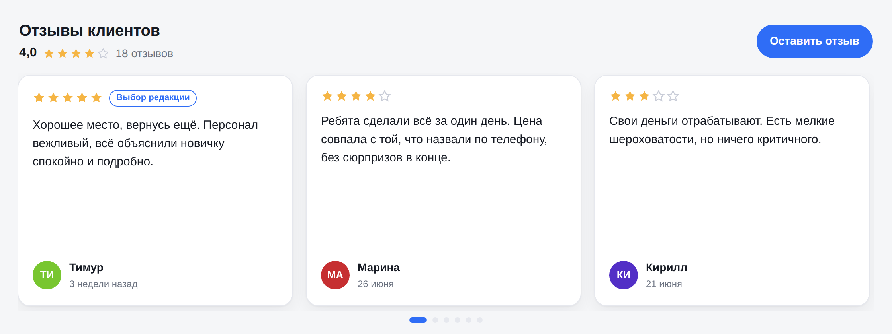

# Виджет отзывов для сайта

Клиент вставляет к себе **одну строчку**:

```html
<script src="https://ваш-сервер/w/s_1a2b3c4d5e.js" async></script>
```

и на странице появляется карусель отзывов, кнопка «Оставить отзыв» и форма
сбора. Отзывы приходят с формы на сайте, по прямой ссылке (QR на чеке,
рассылка), из Telegram-бота или с Яндекс.Карт, 2ГИС и маркетплейсов через
соседний [`reviews-dashboard`](../reviews-dashboard/) — и проходят модерацию,
прежде чем попасть на сайт.

Дальше строчку менять не нужно: тема, цвет, заголовок, автопрокрутка и
фильтр по оценке настраиваются в кабинете и применяются сами.

**Зависимостей нет** — стандартная библиотека Python 3.11+ и чистый JS.
Ни npm, ни сборки, ни внешних сервисов.



## Быстрый старт

```bash
cd reviews-widget

# 1. Завести клиента и сразу набить демо-отзывами
python3 -m widget site add --name "Кофейня «Тёплый угол»" --demo

# 2. Поднять сервер
python3 -m widget serve
# → http://127.0.0.1:8080
```

Команда `site add` печатает ключ сайта, токен админки и готовую строчку для
вставки. **Токен показывается один раз** — сохраните его.

| Адрес | Что там |
|---|---|
| `/` | витрина с живым виджетом и строчкой для вставки |
| `/w/<ключ>.js` | сам виджет — это и есть «одна строчка» |
| `/f/<ключ>` | страница формы отзыва, её можно давать ссылкой |
| `/preview/<ключ>` | как виджет выглядит на пустой странице |
| `/admin` | кабинет модерации (ключ + токен) |

## Как виджет ведёт себя на чужом сайте

* **Не ломает вёрстку.** Всё живёт в Shadow DOM: стили сайта не достают до
  виджета, стили виджета не достают до сайта. Глобальных переменных не
  оставляет, при любой ошибке молча гаснет — страница клиента не пострадает.
* **Не портит текст отзыва.** Данные вставляются только через `textContent`,
  так что отзыв со скриптом внутри останется просто текстом.
* **Не прыгает при загрузке.** До ответа сервера показываются карточки-
  заглушки той же высоты.
* **Карусель настоящая.** Свайп на телефоне, стрелки и точки на десктопе,
  стрелки ← → с клавиатуры, автопрокрутка с паузой при наведении и при
  уходе вкладки в фон. При `prefers-reduced-motion` анимации выключаются.
* **Подстраивается под ширину.** Сколько карточек влезло, столько и
  показывает: три на десктопе, одна на телефоне.
* **Если отзывов нет — виджета нет.** Пустой блок на странице не остаётся.

Ключ и настройки зашиты в `/w/<ключ>.js`, поэтому теги `data-*` не нужны.
Но если хочется поставить виджет в конкретное место или переопределить
настройку — можно:

```html
<!-- виджет встанет сюда, а не на место тега script -->
<div data-reviews-widget></div>

<!-- общий скрипт: ключ и настройки прямо в теге -->
<script src="https://ваш-сервер/embed.js" data-site="s_1a2b3c4d5e"
        data-theme="dark" data-layout="grid" data-limit="9" async></script>
```

Что понимают атрибуты: `theme`, `accent`, `layout`, `limit`, `min-rating`,
`autoplay`, `interval`, `title`, `show-summary`, `show-form-button`,
`form-button-text`, `card-min-width`, `radius`.

## Откуда берутся отзывы

**Форма на сайте.** Кнопка «Оставить отзыв» в шапке виджета открывает форму
в модальном окне. Та же форма живёт по адресу `/f/<ключ>` — её можно дать
ссылкой в рассылке или напечатать QR-кодом на чеке.

**Telegram-бот.** Заводится за минуту:

```bash
python3 -m widget site set --site s_1a2b3c4d5e \
    --telegram-token 123456:AA... --telegram-chat 987654321
python3 -m widget bot          # или --site, чтобы поднять одного
```

Гость пишет боту `/start`, ставит оценку кнопками, присылает текст и
выбирает — подписаться именем или анонимно. Владельцу отзыв прилетает в
чат с кнопками **✅ Опубликовать** / **🚫 Отклонить**: модерация возможна
вообще без захода в админку. `--telegram-chat` — это ваш chat id, узнать
его можно у `@userinfobot`.

**Отзывы с Яндекс.Карт, 2ГИС и маркетплейсов.** Их собирает соседний проект
[`reviews-dashboard`](../reviews-dashboard/), а виджет забирает готовое из его
базы:

```bash
# что вообще собрано дашбордом
python3 -m widget pull --site s_1a2b3c4d5e --list

# перенести на сайт четвёрки и пятёрки с Яндекс.Карт
python3 -m widget pull --site s_1a2b3c4d5e --source yandex --min-rating 4
```

Связь односторонняя и читающая: база дашборда открывается в режиме `mode=ro`,
испортить её импорт не может, а Python-код дашборда не импортируется — виджет
ставится и на сервер, где никакого дашборда рядом нет.

Что переносится: текст (у маркетплейсов вместе с блоками «достоинства» и
«недостатки»), оценка, автор, дата отзыва и ответ компании. Отзывы без оценки
не берутся — виджету не из чего рисовать звёзды. Повторный запуск ничего не
задваивает.

По умолчанию всё попадает в очередь модерации: даже если площадка отзыв
опубликовала, решать, показывать ли его у себя, должен владелец сайта. Флаг
`--publish` публикует сразу, но помеченное антиспамом всё равно уйдёт на
проверку.

Чтобы кнопка появилась и в кабинете, укажите серверу базу дашборда:

```bash
python3 -m widget serve --dashboard-db ../reviews-dashboard/data/reviews.db
```

Без флага вкладка «С площадок» честно скажет, что импорт не подключён, и
покажет команду для консоли.

> Тексты отзывов принадлежат их авторам, а у площадок есть свои правила
> использования. Прежде чем публиковать чужие отзывы на своём сайте, проверьте
> условия площадки — технически перенос возможен, юридически это ваша
> ответственность.

**Импорт.** Старые отзывы из выгрузки или таблицы:

```bash
python3 -m widget import --site s_1a2b3c4d5e --file reviews.csv --publish
```

JSON или CSV, колонки распознаются по синонимам (`Отзыв`/`text`/`comment`,
`Оценка`/`rating`/`stars`, `Имя`/`author` и так далее).

## Модерация и антиспам

По умолчанию каждый отзыв попадает в очередь и виден только после
одобрения. Можно включить автопубликацию с порогом по оценке:

```bash
python3 -m widget site set --site s_1a2b3c4d5e --auto-approve on --auto-approve-from 4
```

Даже при автопубликации подозрительное уходит на модерацию. До базы отзыв
не доедет, если сработали проверки:

* скрытое поле-ловушка, которое заполняют только боты;
* форма заполнена быстрее трёх секунд;
* не больше 5 отзывов в минуту и 20 в час с одного IP;
* ссылки, телефоны, рекламные слова, капс и повторы — считаются баллы, и
  при явном перевесе отзыв отклоняется, а при подозрении просто помечается
  флагом для модератора;
* одинаковый текст не задваивается — у отзыва есть отпечаток.

Отзывы с чужих доменов принимаются только если домен разрешён:

```bash
python3 -m widget site set --site s_1a2b3c4d5e --domains "example.ru, shop.example.ru"
```

Пустой список = принимать откуда угодно, это удобно при отладке и не годится
для боевого сайта.

**Негатив лучше не удалять, а отвечать.** Ответ компании публикуется прямо
под отзывом — в кабинете это кнопка «Ответить».

## Команды

```bash
python3 -m widget site add --name "Компания" [--domains ...] [--demo]
python3 -m widget site list
python3 -m widget site show --site КЛЮЧ          # ключ и строчка вставки
python3 -m widget site set  --site КЛЮЧ --setting theme=dark --setting limit=12
python3 -m widget site rotate-token --site КЛЮЧ  # если токен потерян
python3 -m widget site rm   --site КЛЮЧ

python3 -m widget serve [--host 0.0.0.0] [--port 8080] [--public-url https://...]
                        [--dashboard-db ../reviews-dashboard/data/reviews.db]
python3 -m widget bot [--site КЛЮЧ]

python3 -m widget demo     --site КЛЮЧ --count 18
python3 -m widget import   --site КЛЮЧ --file reviews.csv [--publish]
python3 -m widget pull     --site КЛЮЧ [--list] [--from БАЗА] [--company "..."]
                           [--source yandex|2gis|wildberries|ozon]
                           [--min-rating 4] [--since 2026-01-01] [--publish]
python3 -m widget reviews  --site КЛЮЧ [--status pending]
python3 -m widget moderate --id 42 --action publish|reject|pin|unpin
python3 -m widget export   --site КЛЮЧ
```

Настройки виджета (`--setting КЛЮЧ=ЗНАЧЕНИЕ`): `title`, `theme`, `accent`,
`layout`, `limit`, `min_rating`, `autoplay`, `interval`, `show_summary`,
`show_form_button`, `form_button_text`, `card_min_width`, `radius`,
`seo_schema`.

## Установка на сервер

### Docker

```bash
cp .env.example .env          # там только внешний адрес
docker compose up -d --build
```

База и отзывы лежат в примонтированном `./data`, поэтому обновление образа
не стирает клиентов. Контейнер слушает только localhost — снаружи ставится
nginx.

### Без docker

```bash
python3 -m widget serve --host 127.0.0.1 --port 8080 \
    --public-url https://widgets.example.ru
```

Готовый systemd-юнит лежит в [`deploy/reviews-widget.service`](deploy/reviews-widget.service).

Всё настраивается и переменными окружения — так удобнее в контейнере:
`WIDGET_DB`, `WIDGET_HOST`, `WIDGET_PORT`, `WIDGET_PUBLIC_URL`,
`WIDGET_DASHBOARD_DB`. `WIDGET_PUBLIC_URL` нужен, чтобы виджет, форма и
подсказки в консоли знали внешний адрес, а не адрес за прокси.

### nginx

Пример конфига — [`deploy/nginx.conf`](deploy/nginx.conf). Что в нём важно:

* **HTTPS обязателен.** Страница по https не станет подключать скрипт по http,
  то есть без сертификата виджет просто не появится.
* **`X-Forwarded-For` нужно передавать.** Без него антифлуд по IP будет
  считать всех посетителей одним — адресом самого nginx.
* **Кеш на `/w/*.js` и `/api/v1/widget`.** Сервер на stdlib выдаёт порядка
  150 запросов в секунду при одновременных обращениях (около 500, если они
  идут по одному); закешированную строчку кода nginx отдаёт на порядки
  быстрее. Для десятков небольших сайтов хватает и без кеша, но он снимает
  вопрос на всплесках.

Что стоит помнить:

* **Токен админки** — это доступ ко всем отзывам сайта. В базе он хранится
  хешем (соль + SHA-256), поэтому показать его повторно нельзя: при потере
  выдайте новый командой `site rotate-token`. Отдавайте токен клиенту по
  защищённому каналу и не кладите базу в репозиторий (она уже в `.gitignore`).
* **Отзывы — персональные данные.** Имя и контакты присылают живые люди.
  Контакт в виджет не отдаётся, но он лежит в базе и виден в кабинете.
  Нужны политика обработки данных и согласие — короткая строчка про это
  уже стоит под кнопкой формы.
* **Разметка schema.org** (`seo_schema`) добавляет на страницу клиента
  агрегированный рейтинг. Включайте её только если отзывы настоящие: за
  разметку выдуманных оценок поисковики наказывают весь сайт.

## Разработка

```bash
python3 -m unittest discover -s tests -t .
```

147 тестов, сети не требуют: HTTP проверяется на настоящем сервере, поднятом
на случайном порту, а база `reviews-dashboard` для тестов импорта собирается
на месте — соседний проект для прогона не нужен.

Виджет исполняется на чужой странице, и половина его багов видна только в
браузере, поэтому есть отдельный смоук на Playwright:

```bash
cd tests/browser && npm install
node smoke.mjs http://127.0.0.1:8080 КЛЮЧ ТОКЕН
```

Он проверяет то, что уже ломалось руками: карусель листается, на телефоне
карточка одна в ряд, сайт с глобальным `* { ... !important }` не пробивает
изоляцию (и сам не страдает), ключ с тега `<script>` работает и с явным
контейнером, отзыв проходит путь «форма → модерация → сайт», а сайт без
опубликованных отзывов не оставляет на странице пустого блока. Это
единственное место в проекте с внешней зависимостью — сам виджет
по-прежнему без них.

Структура:

```
widget/
  models.py       модели и вся валидация входящих данных
  storage.py      SQLite: сайты и отзывы
  moderation.py   антиспам, лимиты, решение об автопубликации
  server.py       HTTP: виджет, API, форма, кабинет
  telegram.py     бот сбора отзывов и уведомления владельцу
  dashboard.py    импорт отзывов с площадок из базы reviews-dashboard
  demo.py         демо-отзывы для показа клиенту
  cli.py          командная строка
  assets/
    widget.js     сам виджет (Shadow DOM, карусель) — то, что уезжает на сайт
    form.*        форма отзыва
    admin.*       кабинет модерации
    index.html    витрина, preview.html — превью
tests/browser/  браузерный смоук на Playwright
deploy/         nginx и systemd для боевого сервера
```
