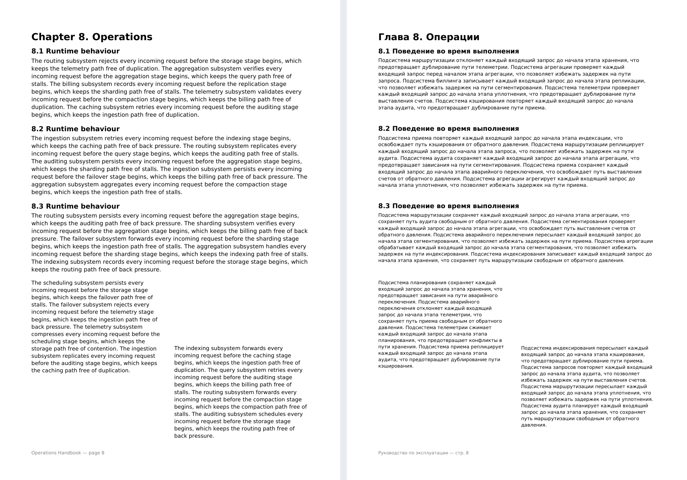
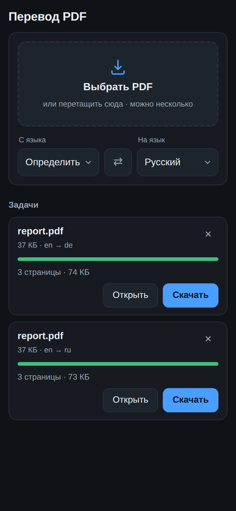
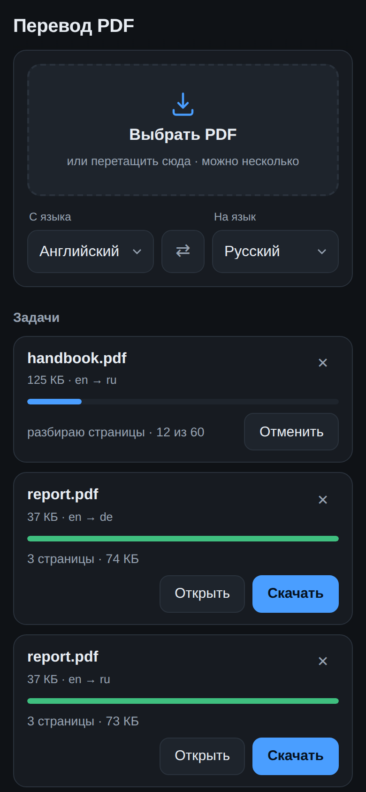

# pdf-translator — перевод больших PDF с сохранением вёрстки

Приложение для телефона: кидаешь PDF — получаешь тот же документ на другом
языке. Не текстовую выжимку, а именно документ: с картинками, таблицами,
колонками, печатями и подписями на своих местах.



Слева оригинал, справа результат. Заголовки остались заголовками, колонки —
колонками, колонтитул — колонтитулом. Ни одна картинка не потерялась, потому
что исходная страница не пересобирается заново: в неё вносится ровно одна
правка — исходные буквы становятся невидимыми, а перевод печатается на их месте
тем же кеглем и с тем же выключением.

Всё на стандартной библиотеке Python: свой разбор PDF, свой разбор шрифтов,
своя вёрстка, свой сборщик файла. Внешних зависимостей нет ни одной.

## Как выглядит

<p>
  
  
</p>

Приложение ставится на домашний экран как обычное (это PWA — работает и на
Android, и на iPhone, магазины не нужны). Файл можно выбрать кнопкой,
перетащить или отправить из любого приложения через «Поделиться».

## Запуск

```bash
docker compose up -d --build
```

Дальше открыть на телефоне `http://адрес-компьютера:8080` — адрес сервер
печатает при старте — и добавить страницу на домашний экран: в Chrome это
«Установить приложение», в Safari — «На экран „Домой“».

Без Docker:

```bash
pip install -e .
python -m pdftr serve
```

Нужен Python 3.11+ и хотя бы один шрифт с нужной письменностью
(`apt install fonts-dejavu-core` — латиница, кириллица, греческий).

## Из командной строки

```bash
python -m pdftr translate книга.pdf --to ru        # → «книга (ru).pdf»
python -m pdftr translate report.pdf out.pdf --from en --to de
python -m pdftr inspect скан.pdf                   # что внутри файла
python -m pdftr languages                          # список языков
```

## Что происходит внутри

Перевести PDF сложнее, чем кажется, потому что PDF не хранит текст. Он хранит
команды рисования: «поставь такой-то глиф в такую-то точку». Ни абзацев, ни
строк, ни даже слов там нет — их надо восстанавливать. Работа идёт в пять шагов.

**1. Чтение файла.** Свой разбор формата: обе разновидности таблицы объектов
(классическая и таблица-поток), объекты, упакованные в `ObjStm`, фильтры
Flate/LZW/ASCII85/ASCIIHex/RunLength с предикторами. Если таблица объектов
врёт — а врёт она часто: файл склеили, обрезали, дописали руками — ридер
прочёсывает файл целиком и строит её заново. Так открываются документы,
которые не открывает половина просмотрщиков. Файл под паролем не мучаем, а
честно говорим, что его надо сначала расшифровать.

**2. Текст с координатами.** Контент-поток страницы — это программа, и
координаты строк получаются только её выполнением: матрицы преобразований,
кегль, межбуквенный и межсловный интервал, вложенные Form XObject. Байты
превращаются в буквы через шрифт: сначала `ToUnicode`, потом `/Encoding` с
`/Differences`, потом встроенная в шрифт таблица `cmap`. Если ни один источник
не отвечает, шрифт помечается ненадёжным и его текст не трогается вовсе —
испортить страницу мусором хуже, чем оставить кусок непереведённым.

**3. Вёрстка.** Прогоны собираются в строки по общей базовой линии, строки — в
абзацы по отступам и промежуткам. Колонки разводит рекурсивный XY-cut: страница
режется по самой заметной пустоте, сначала вдоль, потом поперёк. Заголовок во
всю ширину не даёт разрезать страницу вертикально, зато отбивка под ним
разрезает горизонтально — а уже ниже межколонник виден насквозь. Без этого
текст левой колонки склеился бы с правой, и переводчик получил бы кашу.
Заодно определяются выключка, цвет текста и цвет плашки под ним.

**4. Перевод.** Бесплатный endpoint Google Translate — без ключей и без денег.
Абзацы уходят пачками до четырёх тысяч знаков за раз, повторы схлопываются,
переведённое ложится в общий SQLite-кэш (в документе на четыреста страниц
колонтитулы и заголовки повторяются сотни раз). Есть ограничитель частоты и
повторы с нарастающей паузой. Если ответ вернулся с другим числом строк, чем
было отправлено, пачка переспрашивается по одной — лучше медленнее, чем
перепутать местами абзацы.

**5. Сборка.** Объекты исходника переносятся в новый файл как есть, а в
контент-потоке страницы операторы, нарисовавшие переведённый текст,
обрамляются переключением режима отрисовки на невидимый. Оператор не
вырезается: сдвиг текстовой матрицы, который он делает, нужен следующим
строкам. Сверху дописывается перевод — с автоподбором кегля, чтобы уместиться
в исходную рамку, и переносами по ширине колонки. Строка-одиночка (пункт
списка, подпись, ячейка) при нужде разрешает себе расти вправо до соседнего
блока: перевод почти всегда длиннее оригинала, и ломать такую строку надвое
из-за пары лишних букв незачем.

## Большие файлы

Всё сделано под них, иначе задача не имеет смысла: маленький PDF проще
перевести вручную.

* Загрузка идёт на диск потоком — файл на сотню мегабайт не попадает в память
  целиком ни на одном шаге.
* Страницы обрабатываются пачками по двенадцать: прогресс виден с первых
  секунд, а не через десять минут молчания.
* Перевод идёт в фоне. Телефон можно заблокировать, вкладку закрыть, сеть
  потерять — задача от этого не пострадает, состояние лежит в SQLite.
* Сервер можно перезапустить посреди работы: незаконченные задачи встают
  обратно в очередь, а переведённое достаётся из кэша почти мгновенно.
* Задачу можно отменить, не дожидаясь конца.

Для примера: руководство на 60 страниц (200 тысяч знаков) переводится примерно
за 20 секунд, повторно — за 12 из кэша.

## Настройки

Всё задаётся флагами `serve`:

| Флаг | По умолчанию | Зачем |
| --- | --- | --- |
| `--port` | `8080` | порт |
| `--data` | `data` | каталог с задачами, файлами и кэшем |
| `--workers` | `4` | потоков перевода |
| `--rate` | `4` | запросов в секунду к переводчику |
| `--max-upload` | `300` | предел размера файла, МБ |
| `--font` | — | свой `.ttf`, если системный не устраивает |

Шрифт подбирается по языку перевода сам. Если для языка не нашлось шрифта с
нужными знаками, задача не молча отдаст квадраты, а скажет, какой пакет
поставить. Для иероглифов соберите образ с `--build-arg CJK=1` или поставьте
`fonts-noto-cjk`.

## API

Приложение — обычный клиент этого API, так что перевод можно встроить куда
угодно.

```
GET    /api/config              языки и ограничения
POST   /api/jobs?name=&source=&target=   тело — сам PDF, ответ — задача
GET    /api/jobs                список задач
GET    /api/jobs/{id}           состояние
GET    /api/jobs/{id}/events    прогресс потоком (Server-Sent Events)
GET    /api/jobs/{id}/file      переведённый файл
GET    /api/jobs/{id}/source    исходный файл
DELETE /api/jobs/{id}           отменить и удалить
POST   /share                   приём из «Поделиться» (multipart)
```

```bash
curl -X POST --data-binary @книга.pdf \
     -H 'Content-Type: application/pdf' \
     'http://localhost:8080/api/jobs?name=книга.pdf&source=auto&target=ru'
```

## Чего приложение не умеет

Честный список, чтобы не было сюрпризов.

* **Сканы без распознавания.** Если в PDF нет текстового слоя, переводить
  нечего — `inspect` про такой файл прямо это и скажет. Прогоните файл через
  OCR и возвращайтесь.
* **Файлы под паролем.** Расшифровку не делаем; снимите защиту в просмотрщике.
* **Текст в картинках.** Подписи внутри растровых схем остаются как были.
* **Повёрнутый текст.** Вертикальные подписи на полях и в таблицах не трогаем:
  переставить их, ничего не сломав, надёжно не получается.
* **Текст внутри Form XObject** заклеивается фоном, а не прячется. Такой объект
  может использоваться несколькими страницами сразу, и правка его потока
  испортила бы соседние.
* **Качество перевода** — ровно то, что даёт бесплатный Google Translate.
  Endpoint неофициальный: он может ответить отказом при слишком частых
  обращениях (на это есть повторы и ограничитель частоты) и в принципе может
  закрыться.

## Разработка

```bash
pip install -e ".[dev]"
pytest -q          # 158 тестов, сеть не нужна: переводчик подменён заглушкой
ruff check .
```

Тестовые PDF собираются на лету в `tests/conftest.py` — и обычные, и с
таблицей-потоком, и с объектами внутри `ObjStm`. Проверять на одном настоящем
файле бессмысленно: важна работа с устройством формата, а не с конкретным
документом.

Модули `pdftr/pdf/objects.py` и `pdftr/pdf/embed.py` перенесены из
[`proposal-generator`](../../scripts/proposal-generator/): там они собирают коммерческие
предложения, здесь печатают перевод поверх чужой страницы. Логика оказалась
одна и та же, менять её не пришлось.
